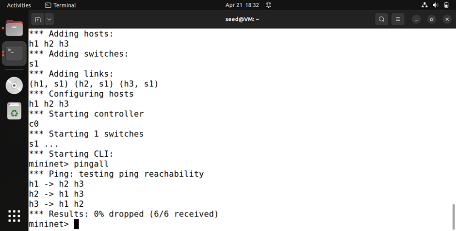
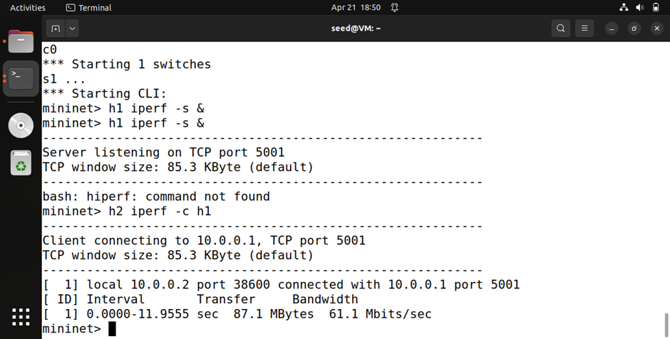
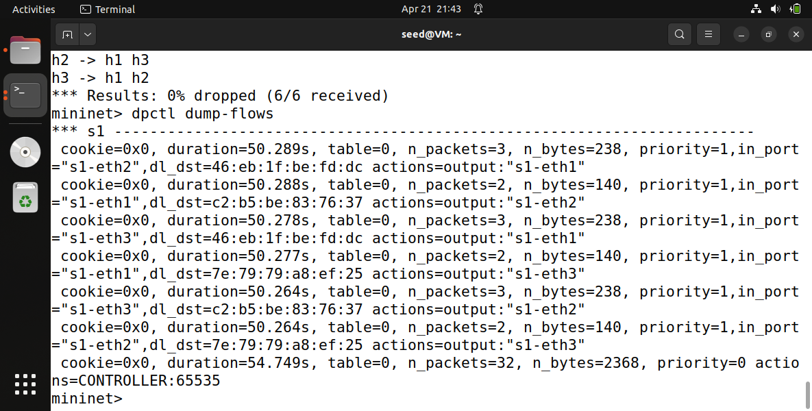
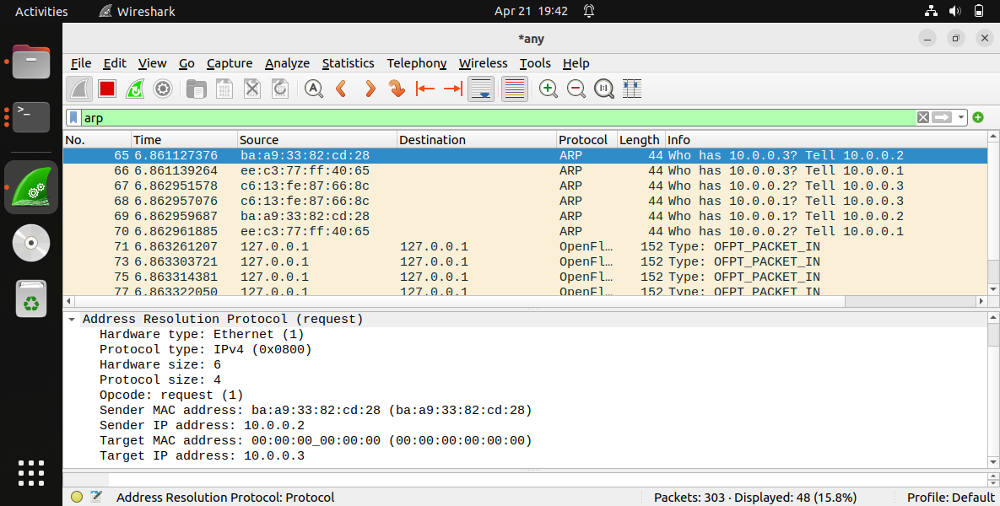
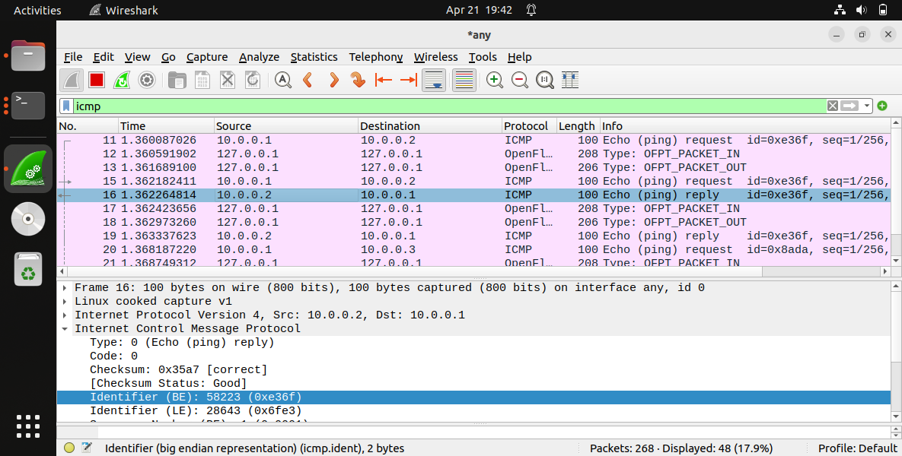

# SDN Traffic Monitoring and Statistics Collector

## 📌 Problem Statement
The objective of this project is to design and implement a Software Defined Networking (SDN) solution using Mininet and Ryu controller that collects and displays traffic statistics in real time.

The system demonstrates:
- Controller–switch interaction
- Flow rule design (match–action)
- Network behavior observation

---

## 🎯 Objectives
- Build an SDN controller using Ryu
- Implement learning switch functionality
- Collect flow statistics (packets & bytes)
- Monitor traffic periodically
- Demonstrate allowed vs blocked communication
- Analyze network using tools like Wireshark and iperf

---

## 🧱 Topology Used
- 3 Hosts → h1, h2, h3  
- 1 Switch → s1  
- Remote Controller → Ryu  


---

## ⚙️ Setup Instructions

### 1. Start Ryu Controller
```bash
python3 -m ryu.cmd.manager traffic_monitor.py

2. Start Mininet
sudo mn -c
sudo mn --topo single,3 --controller remote

```

---

## SDN Logic & Flow Rules

### ✔ Packet Handling
Controller receives packet_in
Learns MAC → port mapping
Decides output port

### ✔ Match Fields
Destination MAC address (eth_dst)
Input port (in_port)

### ✔  Action
Forward packet to correct port
Flood if unknown

### ✔ Flow Installation
Flow rules installed dynamically
Priority = 1 for learned flows
Table-miss rule sends packets to controller

---

## 🔄 Working Scenarios

### ✅ Scenario 1: Normal (All Allowed)
All hosts communicate
Output:
0% packet loss (6/6 received)

### ❌ Scenario 2: Blocked (Firewall Behavior)
Communication between selected hosts blocked
Output:
33% packet loss (4/6 received)

---

## 📊 Performance Analysis

### 🔹 Ping (Latency)
Measures connectivity and delay
Result: 0% packet loss in normal case

### 🔹 Iperf (Throughput)
Measures bandwidth between hosts
Example: ~60 Mbps

### 🔹 Flow Table Observation
dpctl dump-flows
Shows installed flow rules
Displays packet/byte count

### 🔹 Traffic Monitoring
Controller periodically prints:
Packets: X   Bytes: Y

---

## 📸 Screenshots

### 🔹 Ping Output (0% Packet Loss)
Shows successful communication between all hosts.


---

### 🔹 Iperf Throughput Test
Displays bandwidth measurement between hosts.


---

### 🔹 Flow Table Entries (OpenFlow Rules)
Shows dynamically installed flow rules in the switch.


---

### 🔹 Wireshark Capture – ARP Packets
Displays ARP request and reply for MAC address resolution.


---

### 🔹 Wireshark Capture – ICMP Packets
Shows ICMP Echo Request and Reply (ping packets).


---
## 🔍 Observations
ARP packets resolve MAC addresses
ICMP packets show ping communication
Flow rules reduce controller load
Packet count increases with traffic

---

## ✅ Functional Features Implemented

✔ Learning Switch (Forwarding)
✔ Traffic Monitoring
✔ Flow Statistics Collection
✔ Firewall Behavior (Blocking)
✔ Packet Analysis using Wireshark
✔ Performance Testing using iperf

---

## 🧪 Validation

Verified connectivity using pingall
Verified throughput using iperf
Verified flow rules using dpctl dump-flows
Verified packets using Wireshark

---
## 📁 Project Structure

sdn-traffic-monitor/
│── traffic_monitor.py
│── README.md
│── screenshots/
    ├── ping.png
    ├── iperf.png
    ├── flowtable.png
    ├── wireshark_ARP.png
    ├── wireshark_ICMP.png

## 📚 Tools Used
Mininet
Ryu Controller
Wireshark
iperf
👨‍💻 Author

Prabhakar Kumar
GitHub: https://github.com/prabhakarkumar123

## 🎯 Conclusion

This project successfully demonstrates SDN concepts including controller-based forwarding, flow rule installation, and real-time traffic monitoring. The system effectively shows both normal and restricted network behavior using OpenFlow rules.
